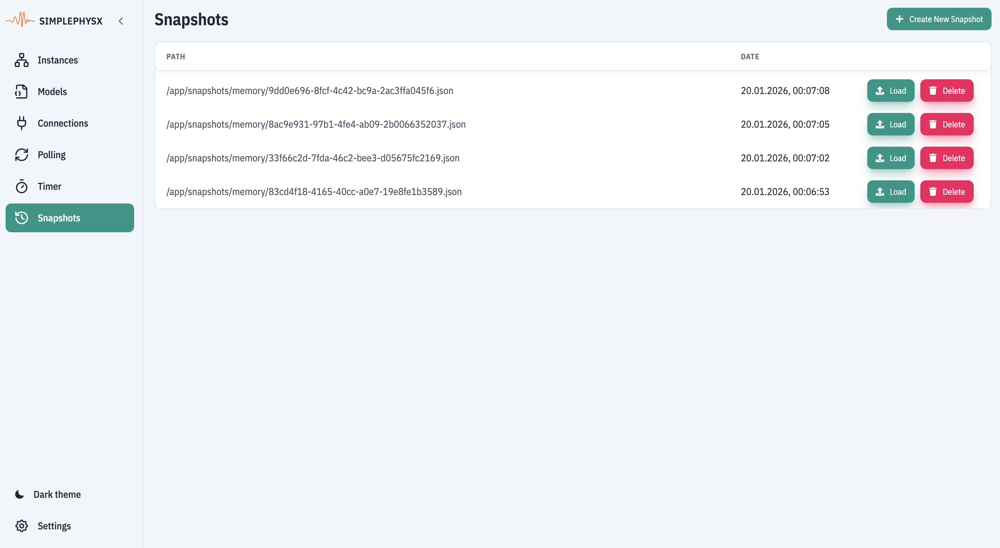

# Snapshots

## Purpose

The Snapshots view lets you capture a known-good state and restore it later. Use it to reset instances between checks or to compare behavior before and after changes.

Back to UI Overview: [UI Overview](general-view.md).

## Where to find it

In the UI navigation, select **Snapshots**.

## What you can do here

* Browse existing snapshots for the current stack (path and date).
* Create a new snapshot (optional name) before making changes.
* Load a snapshot to restore the system state, or delete snapshots you no longer need.

## Snapshots list

The list shows saved snapshots with path and date. Each row includes actions to load or delete that snapshot.

<figure><figcaption>
List of system snapshots
</figcaption></figure>

## Create a snapshot

Use **Create New Snapshot** to capture the current system state. The name field is optional.

<figure><figcaption>
New snapshot popup
</figcaption></figure>

## Load or delete a snapshot

Use **Load** to restore the system to the selected snapshot, or **Delete** to remove it. Both actions require confirmation.

<figure><figcaption>
Load snapshot confirmation
</figcaption></figure>

<figure><figcaption>
Delete snapshot confirmation
</figcaption></figure>

## Typical workflow

1. Open **Snapshots**.
2. Create a snapshot before you run a scenario or test.
3. Make your changes or run the scenario.
4. Load the snapshot to reset state.
5. Return to **Instances** and confirm values match the baseline.

## What to verify

* Integrator: restoring a snapshot returns values to the expected baseline.
* QA: snapshots make test setup repeatable.
* Developer: snapshot/restore works before and after model changes.

## Common issues

* Snapshot list is empty: confirm the stack is running and snapshots exist.
* Load fails: check server logs and confirm the snapshot path is valid.
* State does not match baseline: verify you restored the intended snapshot.
* Snapshot creation fails: check server logs and disk space.
